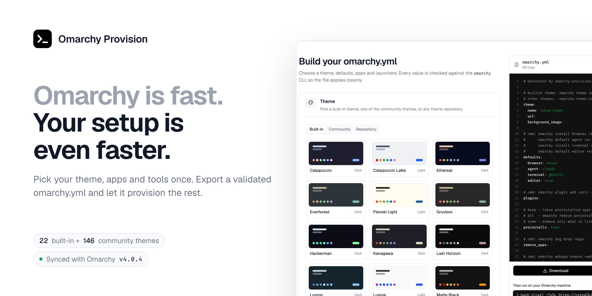

<picture>
  <source media="(prefers-color-scheme: dark)" srcset="docs/readme-banner-dark.png">
  
</picture>

# Omarchy Provision

A static SvelteKit + [shadcn-svelte](https://shadcn-svelte.com) site that builds an
`omarchy.yml` provisioning file. Every option is a predefined select, checkbox or
validated input, so the exported file can only contain values the
[`omarchy` CLI](https://omarchy.org/manual/omarchy-cli/) accepts. Everything runs in the
browser; nothing is sent anywhere. State is kept in `localStorage`.

## Apply it

1. Build your config on the site and click **Download** (it lands in `~/Downloads/omarchy.yml`).
2. On the Omarchy machine, run the command shown under the preview:

   ```bash
   bash <(curl -fsSL https://<your-site>/apply.sh)
   ```

`static/apply.sh` is served next to the page. It finds `omarchy.yml` in the current folder or
`~/Downloads` (or takes a path argument), optionally ranks mirrors and runs `omarchy update -y`,
then applies every section through the `omarchy` CLI. Each step is best-effort, so one failure does
not stop the rest. Use `bash <(curl …)` rather than `curl … | bash`: installers that prompt would
otherwise read the rest of the script as their input.

## Develop

```bash
pnpm install
pnpm dev
pnpm check    # svelte-check
pnpm build    # static site in ./build (adapter-static)
```

## Where things live

| File | Purpose |
| --- | --- |
| `src/lib/options.ts` | All predefined choices (browsers, terminals, editors, agents, themes, preinstalls, services, dev envs). Values match the `omarchy:args` headers of the `omarchy-*` scripts on the `quattro` branch. |
| `src/lib/omarchy.json` | Latest Omarchy release, package lists and built-in theme palettes, generated by `pnpm sync:omarchy` (`scripts/sync-omarchy.mjs`). Don't edit by hand. |
| `src/lib/community-themes.json` | Community themes from [omarchy.org/themes](https://omarchy.org/themes) (name, author, repo, preview, install name), generated by `pnpm sync:themes` (`scripts/sync-community-themes.mjs`). Don't edit by hand. |
| `static/themes/{builtin,community}/` | Theme preview thumbnails (640px webp) written by the two sync scripts. They are self-hosted because the site's CSP only allows same-origin images. Each name ends in the upstream file's blob sha, so a preview is only re-encoded when upstream changes it. Don't edit by hand. |
| `src/lib/icon-catalog.ts` | Quick-pick launcher icons (dashboard-icons PNGs on jsDelivr) and the URL/command matchers that suggest them. App logos in the form come from [Simple Icons](https://simpleicons.org) via the `icon` field in `options.ts`. |
| `src/lib/config.ts` | Config type, field validators, cross-field checks (`checkConfig`) and the YAML generator (`toYaml`). |
| `src/lib/components/` | `OptionSelect`, `CheckGroup`, `TagInput`; `ui/` is shadcn-svelte. |
| `src/routes/+page.svelte` | The form and live YAML preview. |

## Validation

- **Fields:** Arch package names, https Git repo URLs (GitHub / GitLab / Codeberg), http(s) URLs,
  icon names, TUI commands (no quotes or pipes), background filenames.
- **Conflicts (block export):** a package that is both installed and removed, in both pacman and
  AUR, a default browser that is also being removed, duplicate web app / TUI names.
- **Warnings (do not block):** removing all preinstalls also drops the agent stubs, Node dev env
  vs. your own NVM install.

## Exported format

Flat keys and single-level lists, read by `static/apply.sh` (a copy of
`apply-config.sh` from [system-setup](../system-setup/systems/linux/omarchy)). `webapps` entries are `name|url|icon`,
`tuis` entries are `name|command|float-or-tile|icon`. A web app's icon may be empty, which
makes `omarchy webapp install` fetch the site's own icon.

## Omarchy sync & deploy

- `.github/workflows/sync-omarchy.yml` runs every 6 hours (and on demand). It fetches
  `install/omarchy-{base,other}.packages`, every `themes/*/colors.toml` and every
  `themes/*/preview.png` from the latest `basecamp/omarchy` release tag. Version, packages and
  built-in themes therefore always describe the same release (a branch's `version` file is a dev
  marker and is ignored; set `OMARCHY_REF` to preview a branch locally). If anything changed, it
  commits `src/lib/omarchy.json` and `static/themes/builtin/`, then deploys. Run it manually with
  **force_deploy** to redeploy without an upstream change.
- `.github/workflows/sync-community-themes.yml` runs twice a day (and on demand). It reads
  `src/data/themes.json` in `omacom/omarchy-site` (the list omarchy.org/themes renders) and the
  preview images next to it. If anything changed, it commits `src/lib/community-themes.json` and
  `static/themes/community/`, then deploys. Both sync workflows commit through
  `.github/actions/commit-data`.
- `.github/workflows/deploy.yml` builds the site on every push to `main`, on demand, or when a
  sync workflow calls it, uploads it with `scp` and publishes it into `/var/www/omarchy-provision` over
  SSH. New files are copied in before stale ones are removed, so the site never goes empty mid-deploy.

### Server deploy setup

1. Create a deploy key and authorize it for the user that owns `/var/www/omarchy-provision`:

   ```bash
   ssh-keygen -t ed25519 -N '' -C omarchy-provision-deploy -f omarchy-provision-deploy
   ssh-copy-id -i omarchy-provision-deploy.pub stefan@your-server
   ```

2. Add repository secrets (**Settings → Secrets and variables → Actions**): `SSH_HOST`, `SSH_USER`,
   `SSH_PRIVATE_KEY` (contents of `omarchy-provision-deploy`), `SSH_KNOWN_HOSTS` (output of
   `ssh-keyscan -p 22 your-server`, pins the host key) and optionally `SSH_PORT`.
3. Add repository variables: `SITE_URL` (public URL, used for canonical / Open Graph tags and the
   apply command) and, if the site is served under a sub-path, `BASE_PATH`.

## Brand assets

`static/favicon.svg` is the source icon (it inverts in dark browser UIs). `scripts/brand/og.html` is the
1200×630 social card. Run `pnpm brand` to regenerate `favicon.ico`, `apple-touch-icon.png` and `og.png`
(needs `rsvg-convert`, ImageMagick and a Chromium-based browser). Site copy and the author link live in
`src/lib/site.ts`; the deploy workflow sets `VITE_SITE_URL` so Open Graph URLs are absolute.

The README banner (`docs/readme-banner-{light,dark}.png`, 1280×640 at 2x) is
`scripts/brand/readme-banner.html` with a live screenshot of the built site. Run `pnpm brand:readme`
to rebuild it after UI changes; it builds the site, serves it locally and captures both color modes.
The dark banner also works as the repository's social preview (Settings → General → Social preview).
